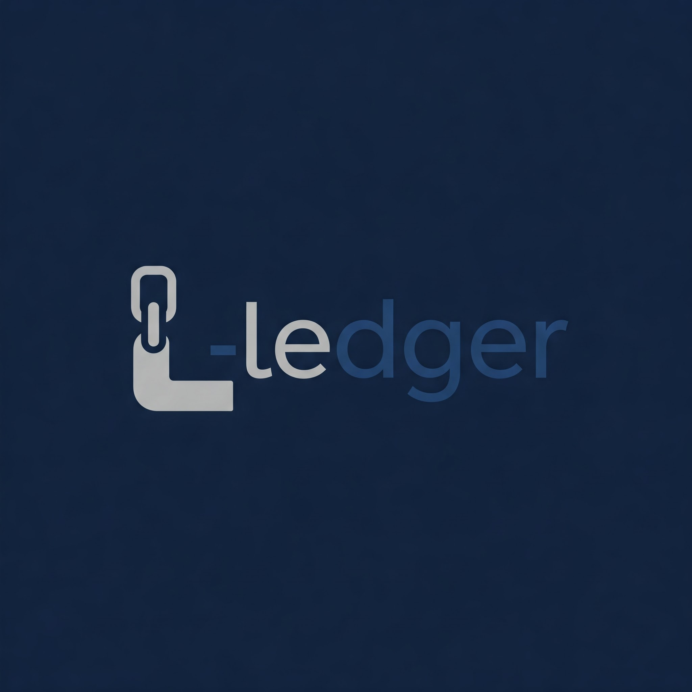

<h1 align="center">L-Edger | Modern Link Management</h1>
<br>

<div align="center">


**Organize, manage, and access your links with ease**

[](https://flutter.dev/)
[](https://dart.dev/)
[](LICENSE)
[](https://github.com/Dwukn/l-edger/releases)

[Download APK](#-download) | [Features](#-features) | [Screenshots](#-screenshots) | [Installation](#-installation) | [Contributing](#-contributing)

</div>

## 📱 Download

Get L-Edger on your Android device now:

- [Download Latest Release APK](https://github.com/Dwukn/l-edger/releases)
- [View All Releases](https://github.com/Dwukn/l-edger/releases)

## 🌟 Features

L-Edger is a powerful yet intuitive Flutter-based link management solution that helps you:

- **Organize Links in Folders** - Create custom folders to categorize your links by topic, project, or priority
- **Quick Access** - Double-tap any link to copy it to your clipboard instantly
- **Powerful Search** - Find links by title, URL, description, or tags across all folders
- **Seamless Management** - Add, edit, or delete links and folders with an intuitive interface
- **Modern UI/UX** - Clean, responsive design optimized for both phones and tablets
- **Offline Access** - Access all your saved links without requiring an internet connection

<!-- ## 📸 Screenshots

<div align="center">
  
  
  
</div> -->

## 🚀 Installation

### For Users
Simply [download the APK](#-download) and install it on your Android device.

### For Developers

1. **Clone the repository:**
   ```bash
   git clone https://github.com/Dwukn/l-edger.git
   ```

2. **Navigate to project directory:**
   ```bash
   cd l-edger
   ```

3. **Install dependencies:**
   ```bash
   flutter pub get
   ```

4. **Run the app:**
   ```bash
   flutter run
   ```

## 📂 Project Structure

```
lib/
├── main.dart            # Application entry point
├── models/              # Data models
│   ├── link.dart        # Link model
│   └── folder.dart      # Folder model
├── providers/           # State management
│   └── link_provider.dart
│   └── link_provider_extension.dart
├── screens/             # App screens
│   └── home_screen.dart
├── utils/
│   └── db_helper.dart   # Database functionality
└── widgets/             # Reusable UI components
    ├── add_folder_form.dart
    ├── add_link_form.dart
    ├── folder_card.dart
    └── link_list.dart
```

## 💻 Technical Details

- **State Management**: Provider pattern
- **Data Persistence**: SQLite via DBHelper
- **Target Platforms**: Android, iOS (coming soon)
<!-- - **Architecture**: Clean architecture with separation of concerns -->

## 🤝 Contributing

Contributions are welcome! Here's how you can help:

1. **Fork** this repository
2. **Create** a new branch: `git checkout -b <feature-name>`
3. **Commit** your changes: `git commit -am 'Add <feature-name>'`
4. **Push** to your branch: `git push origin <feature-name>`
5. **Submit** a pull request

Please make sure to test your changes thoroughly before submitting a pull request.

## 📄 License

This project is licensed under the MIT License - see the [LICENSE](LICENSE) file for details.

## 🙏 Acknowledgments

- Flutter framework team
- Provider package for state management
- All contributors who have helped shape this project
