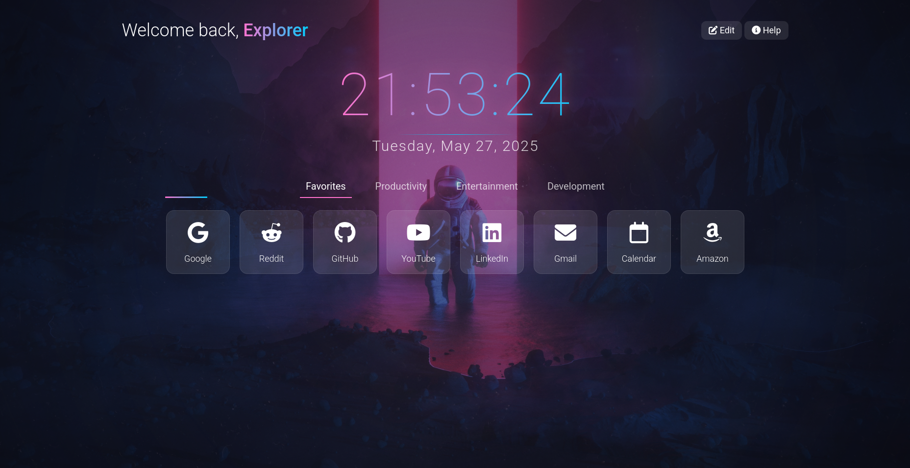

# 🌌 **Venus – Cosmic Dashboard Firefox Theme**

Welcome to **Venus**, a sleek and highly customizable **Firefox new tab theme extension** that blends cosmic visuals with productivity features. Built for dreamers, coders, and space enthusiasts alike, *Venus* transforms your start page into an elegant launchpad for your digital universe.

---

## 🚀 Features at a Glance

### 🌠 Animated Starry Background

A stunning, subtly animated space scene that brings depth and beauty to every new tab.

### 🕒 Live Clock & Date

Keep track of time with a modern, minimalist clock and date display — always front and center.

### 🧭 Tabbed Navigation

Neatly organize your go-to links in intuitive categories:

* `Favorites`
* `Productivity`
* `Entertainment`
* `Development`

### ✏️ Editable Link Cards

Fully customizable cards — update **names, URLs, and icons** with ease via **Edit Mode**.

### ⚙️ Settings Panel

Future features include theme switching, layout options, and more control over your dashboard.

### 📱 Responsive Layout

Crafted with flexibility in mind — works beautifully on both large monitors and smaller screens.

### 🌤️ Weather Widget *(Coming Soon)*

Connect to the **OpenWeather API** to display local, real-time weather info on your dashboard.
---

## 🔧 Installation Guide

### 🧩 From Firefox Add-ons

➡️ Install directly from the Mozilla Add-ons site:
**[Download on Firefox Add-ons](https://addons.mozilla.org/en-US/firefox/addon/spacemen-theme/)**

### 🧪 Load as a Temporary Add-on (Dev Mode)

1. Navigate to `about:debugging` in your Firefox browser.
2. Click **"This Firefox"**.
3. Select **"Load Temporary Add-on"**.
4. Choose your extension’s `manifest.json` file.
5. Voilà! Your theme is now active.

---

## ✨ Customization Tips

* Enter **Edit Mode** to modify your dashboard cards.
* Use [Font Awesome](https://fontawesome.com/icons) classes for icons (e.g., `fab fa-github`, `fas fa-code`).
* Background and theme colors can be tweaked in future updates via the planned settings panel.

---

## 🖼️ Preview

---

## 🔮 Roadmap & Future Enhancements

* 🎨 Theme Switching (Preset palettes)
* 🔖 Bookmarks Integration
* ☁️ Sync via Local Storage
* 🌗 Light & Dark Mode Toggle
* 🎛️ User Customization Panel

---

## 📄 License

This project is licensed under the [MIT License](LICENSE).
Feel free to modify, remix, or contribute.

---

## 🤝 Credits & Acknowledgements

* 🌌 **Background Art by [Beeple](https://www.behance.net/beeple#)**
* 🎨 Icons by [Font Awesome](https://fontawesome.com/)
* 🧠 Inspired by modern dashboards, sci-fi aesthetics, and the open-source community.

---

> *“Somewhere, something incredible is waiting to be known.”*
> — **Carl Sagan**
